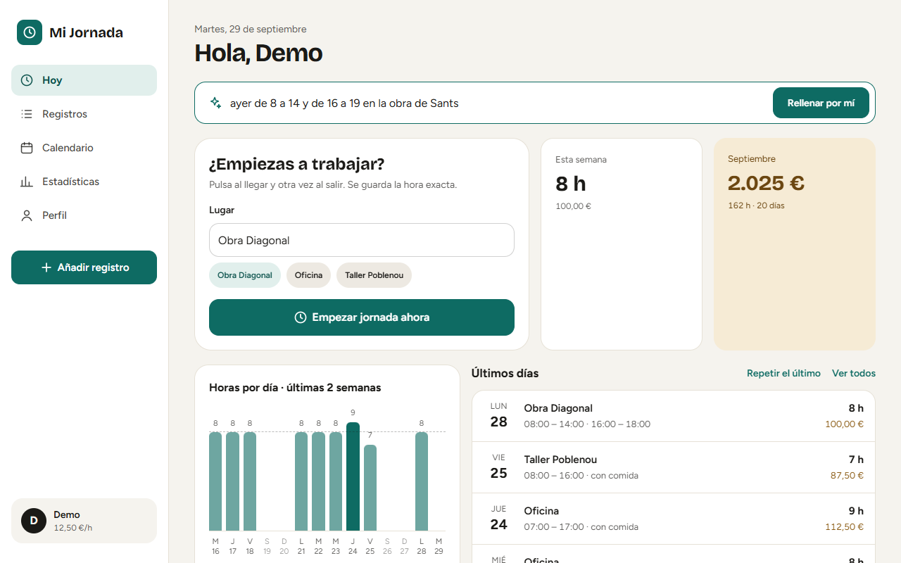
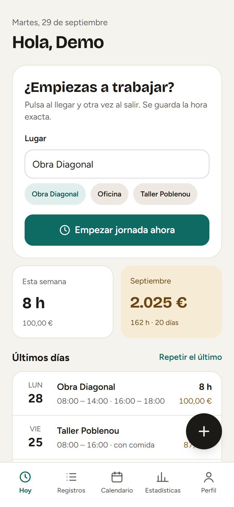
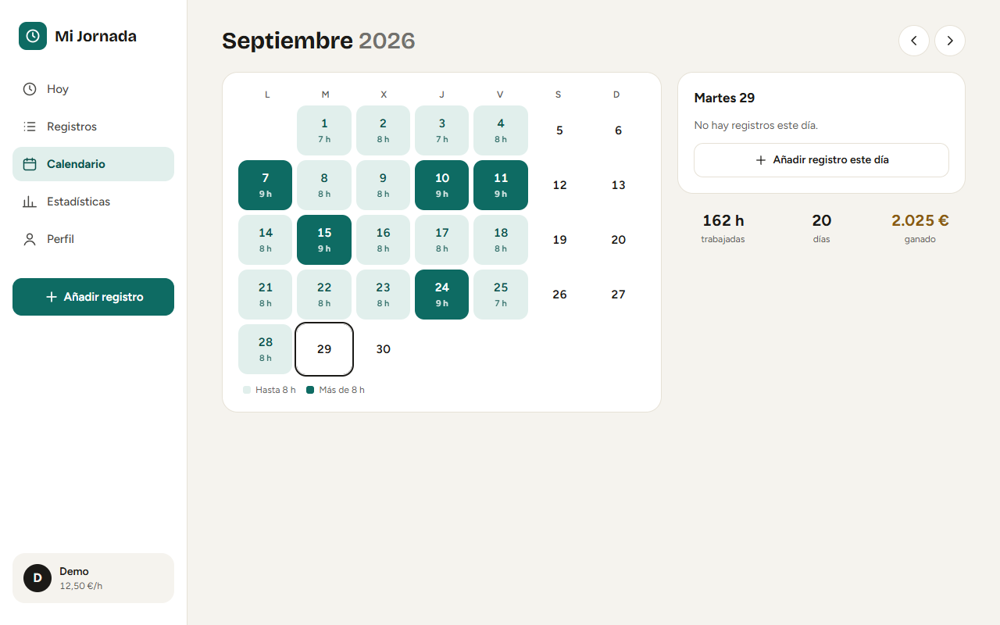
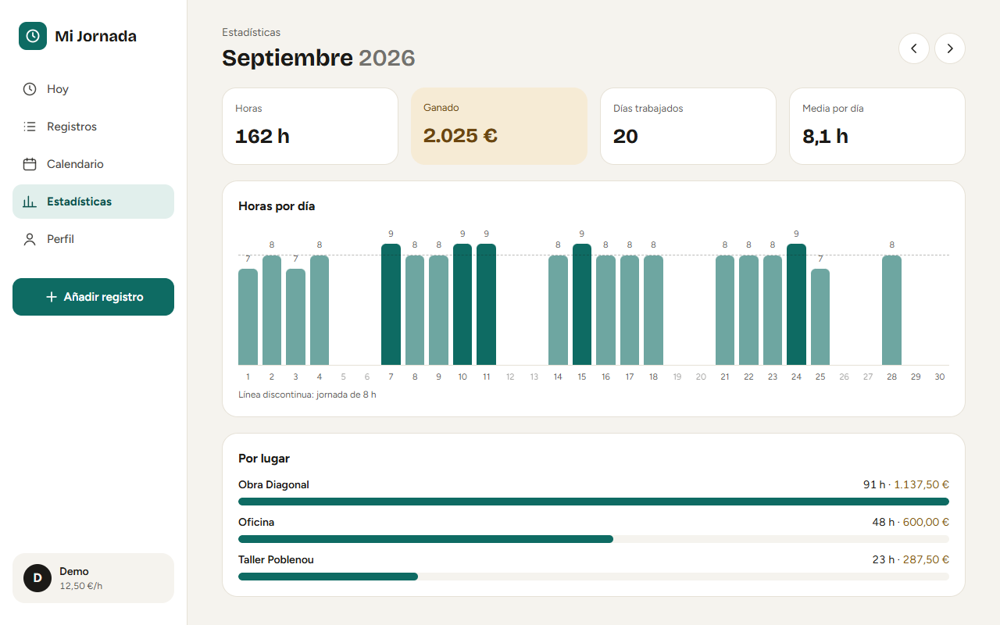
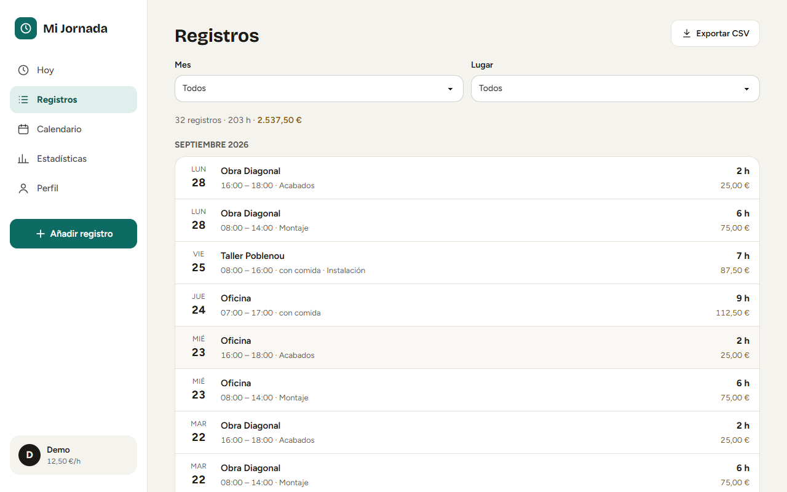
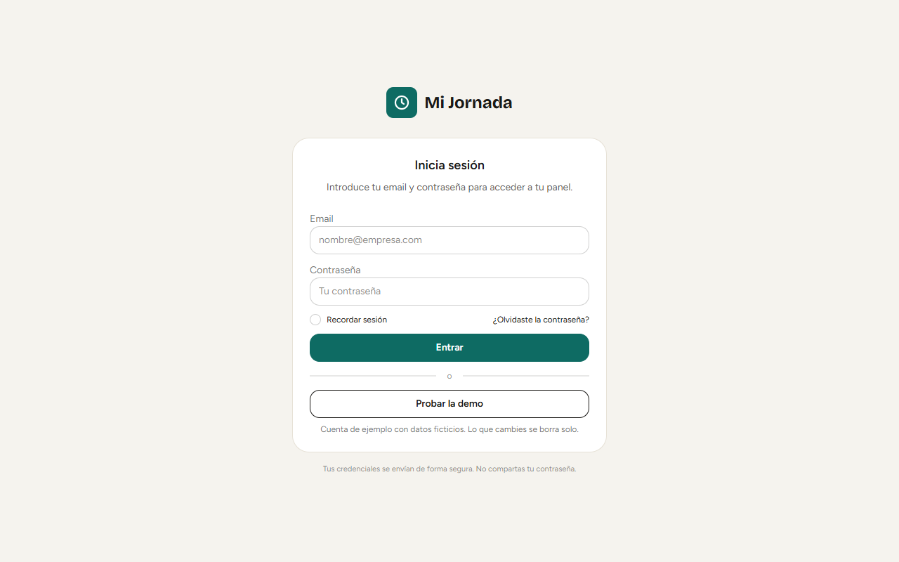

# Mi Jornada

Aplicación web full-stack para registrar jornadas laborales, calcular horas
trabajadas y consultar el sueldo generado por cada registro.

El proyecto está desarrollado con un backend Django y una interfaz frontend
Vue, e incluye autenticación, dashboard, calendario, una API REST y un
asistente de IA para registrar jornadas escribiendo en lenguaje natural.

**Demo en línea:** https://mi-jornada-ashy.vercel.app — pulsa «Probar la demo» para
entrar sin registrarte con una cuenta ficticia que ya tiene semanas de datos de ejemplo.

> Estado: funcional y desplegado en producción; en mejora continua.

## Capturas

<p align="center">
  
  
</p>
<p align="center">
  
  
</p>
<p align="center">
  
  
</p>

## Funcionalidades

### Usuario

- Inicio de sesión mediante email y contraseña (la sesión se mantiene al recargar).
- Fichar: botón para empezar y terminar la jornada con la hora exacta,
  con pausa de comida y opción de descartarla.
- Creación de registros de jornada (formulario corto: Hoy/Ayer, lugares
  sugeridos, repetir el último día, duplicar un día).
- Registro de fecha, hora de entrada y hora de salida.
- Descuento opcional de una hora de comida.
- Descripción y lugar de trabajo.
- Cálculo automático de la duración trabajada.
- Cálculo del sueldo generado.
- Validación de horarios (la salida debe ser posterior a la entrada).
- Listado de registros filtrable por mes y lugar, con exportación a CSV.
- Calendario mensual con las horas de cada día.
- Estadísticas del mes: horas, importe, media diaria, horas por día y por lugar.
- Sugerencias de lugares utilizados anteriormente.
- Diseño pensado para móvil (navegación inferior) y escritorio (barra lateral).
- Modo claro y oscuro.

### Administración

- Panel de administración de Django.
- Gestión de usuarios y perfiles.
- Configuración del sueldo por hora.
- Visualización global de registros.
- Filtros por usuario, fecha, lugar y descanso de comida.
- Búsqueda por usuario, descripción y lugar.

### Asistente de IA

- Registro de jornadas escribiendo o dictando en lenguaje natural:
  «ayer de 8 a 14 y de 16 a 19 en la obra de Sants».
- Un modelo de IA convierte el texto en uno o varios registros (resuelve
  fechas relativas, separa tramos y reconoce los lugares habituales).
  Por defecto Gemini de Google, con plan gratuito; opcionalmente Claude
  (Anthropic), de pago.
- Nada se guarda hasta que el usuario lo revisa y confirma; puede cambiar
  cada tramo o corregirlo a mano.
- Dictado por voz con el reconocimiento del navegador (o el micrófono del teclado).
- Límite de usos diarios por usuario para controlar el gasto.
- Solo se activa si está definida `GEMINI_API_KEY` o `ANTHROPIC_API_KEY`
  (si están las dos, se usa Gemini).
- En el plan gratuito de Gemini, Google puede usar los textos enviados para
  mejorar sus productos: no escribas datos personales sensibles en la caja.

### En desarrollo

- Mejoras adicionales de seguridad y despliegue.

## Tecnologías

### Backend

- Python
- Django
- Django REST Framework
- SQLite en desarrollo, PostgreSQL (Supabase) en producción

### Frontend

- Vue 3
- Vite
- Axios
- TailwindCSS
- DaisyUI
- JavaScript

### IA

- API de Gemini (SDK `google-genai`) con salida JSON según un esquema
- Alternativa: API de Claude (SDK `anthropic`) con salidas estructuradas

### Despliegue

- Vercel (Django como Vercel Function)
- PostgreSQL en Supabase

## Arquitectura

```text
mi_jornada/
├── backend/
│   ├── manage.py
│   ├── mi_jornada/
│   │   ├── settings.py
│   │   ├── urls.py
│   │   └── wsgi.py
│   ├── time_tracker/
│   │   ├── admin.py
│   │   ├── models.py
│   │   ├── serializers.py
│   │   ├── urls.py
│   │   └── views.py
│   └── static/
└── frontend/
    ├── src/
    │   ├── components/   # piezas reutilizables (fichar, formulario, gráfico...)
    │   ├── views/        # pantallas: Hoy, Registros, Calendario, Estadísticas, Perfil
    │   ├── App.vue       # sesión, navegación por #/seccion y tema
    │   ├── api.js
    │   ├── store.js      # estado compartido y llamadas a la API
    │   ├── metricas.js   # totales por día, semana, mes y lugar
    │   ├── utils.js      # formato de horas, euros y fechas
    │   ├── main.js
    │   └── style.css     # temas claro/oscuro de DaisyUI
    ├── public/
    ├── dist/
    ├── package.json
    └── vite.config.js
```

## Modelo de datos

### Profile

Guarda la configuración salarial de cada usuario:

- Usuario.
- Sueldo por hora.

### Registro

Representa una jornada laboral:

- Usuario.
- Fecha.
- Hora de entrada.
- Hora de salida.
- Descripción.
- Lugar.
- Descanso de comida.
- Sueldo por hora aplicado.
- Duración total.
- Duración trabajada.
- Sueldo generado.

### JornadaActiva

Jornada fichada que todavía no ha terminado (como máximo una por usuario):
fecha, hora de entrada, lugar y descanso de comida. Al terminarla se crea el
`Registro` correspondiente y se borra.

### UsoIA

Número de peticiones al asistente por usuario y día, para aplicar el límite
diario (`IA_LIMITE_DIARIO`).

El sueldo por hora se conserva en cada registro para mantener el historial
aunque el usuario cambie posteriormente su tarifa.

## API principal

La API está disponible bajo `/api/`.

### Autenticación

```text
POST /api/login/
POST /api/logout/
GET  /api/me/
GET  /api/csrf-ping/
POST /api/password-reset/
POST /api/password-reset/<token>/
```

### Registros

```text
GET    /api/registros/
POST   /api/registros/
GET    /api/registros/<id>/
PUT    /api/registros/<id>/
PATCH  /api/registros/<id>/
DELETE /api/registros/<id>/
```

### Fichar

```text
GET    /api/jornada/            # jornada en curso o null
PATCH  /api/jornada/            # cambiar lugar o descanso de comida
DELETE /api/jornada/            # descartarla
POST   /api/jornada/iniciar/
POST   /api/jornada/terminar/   # crea el registro (409 si empezó otro día)
```

### Asistente de IA

```text
POST /api/ia/interpretar/   # {"texto": "..."} -> {"registros": [...], "aviso": "..."}; no guarda nada
```

### Utilidades

```text
GET /api/lugares/
```

## Instalación

### Requisitos

- Python 3.10 o superior.
- Node.js y npm.
- Git.

### Clonar el repositorio

```bash
git clone https://github.com/MFloresr/mi_jornada.git
cd mi_jornada
```

### Backend

```bash
cd backend

python -m venv .venv
```

En Windows:

```powershell
.venv\Scripts\Activate.ps1
```

En Linux o macOS:

```bash
source .venv/bin/activate
```

Instalar las dependencias (el archivo `requirements.txt` está en la raíz del repositorio):

```bash
pip install -r ../requirements.txt
```

Aplicar las migraciones:

```bash
python manage.py migrate
```

### Base de datos

Sin configuración adicional se usa SQLite (`backend/db.sqlite3`).

Para usar PostgreSQL (por ejemplo Supabase), define la variable de entorno
`DATABASE_URL` antes de ejecutar `migrate` o arrancar Django. En Supabase,
cópiala de *Project Settings → Database → Connection string* (Session pooler):

```powershell
$env:DATABASE_URL = "postgresql://postgres.<ref>:<password>@<host>:5432/postgres"
```

Iniciar Django (con `DJANGO_DEBUG=1` para que sirva los estáticos en local):

```bash
python manage.py runserver
```

Pruebas del backend (23 pruebas: registros, fichar, estadísticas, asistente de IA, cuentas y demo):

```bash
python manage.py test time_tracker
```

### Frontend

En otra terminal:

```bash
cd frontend
npm install
npm run dev
```

## Desarrollo

Por defecto:

- Backend: `http://127.0.0.1:8000`
- Frontend: `http://localhost:5173`

La URL de la API se configura en:

```text
frontend/src/api.js
```

## Despliegue

En `.env.example` tienes un ejemplo con todas las variables de entorno (la aplicación las lee
del entorno del sistema; el archivo no se carga solo).

El proyecto se despliega en Vercel desde la rama `main`. Vercel detecta
Django por `backend/manage.py`, instala `requirements.txt` y ejecuta
`collectstatic` automáticamente.

El frontend compilado se versiona en el repositorio. Tras cambiar el frontend:

```bash
cd frontend
npm run build
```

Esto genera `backend/static/` y `templates/index.html`.

Variables de entorno necesarias en Vercel:

| Variable | Descripción |
|---|---|
| `DJANGO_SECRET_KEY` | Clave secreta de Django (obligatoria en Vercel). |
| `DATABASE_URL` | Cadena de conexión de PostgreSQL (Supabase). |
| `FRONTEND_BASE_URL` | URL pública, usada en los enlaces de recuperación de contraseña. |
| `DJANGO_ALLOWED_HOSTS` | Opcional: dominios propios separados por comas. |
| `EMAIL_HOST_USER` | Cuenta de Gmail que envía los correos de recuperación. |
| `EMAIL_HOST_PASSWORD` | Contraseña de aplicación de esa cuenta de Gmail. |
| `GEMINI_API_KEY` | Clave gratuita de Google AI Studio para el asistente de IA. Sin ninguna clave de IA, el asistente no aparece. |
| `ANTHROPIC_API_KEY` | Opcional: clave de pago de Anthropic, si se prefiere Claude (solo se usa si no hay `GEMINI_API_KEY`). |
| `IA_MODELO` | Opcional: modelo concreto (por defecto `gemini-3.5-flash` o `claude-opus-5`). |
| `IA_LIMITE_DIARIO` | Opcional: usos del asistente por usuario y día (por defecto 40). |

Las migraciones no se ejecutan en el despliegue: lánzalas desde local con
`DATABASE_URL` apuntando a la base de producción.

## Seguridad

- Las credenciales se gestionan mediante la autenticación de Django.
- Las peticiones utilizan cookies de sesión.
- La API utiliza protección CSRF.
- Los secretos de producción deben configurarse mediante variables de entorno.
- La base de datos local no debe subirse al repositorio.

## Cuenta de demostración

Cualquiera puede probar la aplicación con el botón «Probar la demo» (o entrando en `/?demo=1`).
Es una cuenta ficticia con unas 5 semanas de registros de ejemplo que se regeneran sola si
nadie la ha usado en la última hora. No puede pedir recuperación de contraseña, no tiene
permisos de administración y tiene su propio límite diario de uso del asistente de IA
(`IA_LIMITE_DEMO`). Para regenerarla a mano: `python manage.py preparar_demo`.

## Autor

Mario Flores Rodríguez

- GitHub: [MFloresr](https://github.com/MFloresr)
- Proyecto: [Mi Jornada](https://github.com/MFloresr/mi_jornada)
